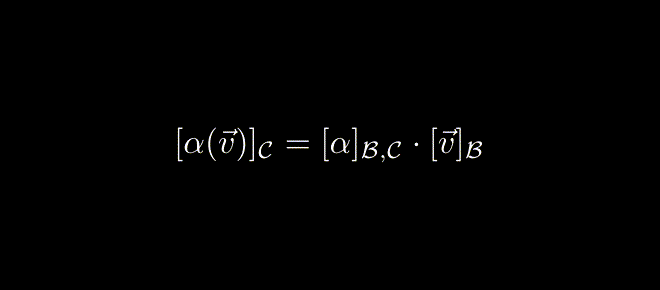

# ManimTSG

[Manim][github-manim] 'Tex String Groups' for hierarchical TeX / LaTeX

The module `ManimTSG` contains the main classes. The submodule `ManimTSG.LinearAlgebra` is an example use

WIP

## Examples

### `test/main.py`

`[\alpha(\vec{v})]_{\mathcal{C}}=[\alpha]_{\mathcal{B},\mathcal{C}}\cdot[\vec{v}]_{\mathcal{B}}`

```
TexStringGroup(['LinearMap.repr_linear_map_matrix_mult'])
└───TexStringGroup([])
    ├───TexStringGroup(['Vector.repr'])
    │   ├───[
    │   ├───TexStringGroup(['Vector.letters'])
    │   │   ├───TexStringGroup(['LinearMap.letter'])
    │   │   │   └───\alpha
    │   │   ├───(
    │   │   ├───TexStringGroup(['LinearMap.argument'])
    │   │   │   └───TexStringGroup(['Vector.letters'])
    │   │   │       ├───TexStringGroup(['Vector.arrow'])
    │   │   │       │   └───\vec{
    │   │   │       ├───v
    │   │   │       └───}
    │   │   └───)
    │   ├───]
    │   └───TexStringGroup(['subscript'])
    │       ├───_{
    │       ├───TexStringGroup(['Basis.letter'])
    │       │   └───\mathcal{C}
    │       └───}
    ├───=
    ├───TexStringGroup(['LinearMap.repr'])
    │   ├───[
    │   ├───TexStringGroup(['LinearMap.letter'])
    │   │   └───\alpha
    │   ├───]
    │   └───TexStringGroup(['subscript'])
    │       ├───_{
    │       ├───TexStringGroup(['LinearMap.basis_from'])
    │       │   └───TexStringGroup(['Basis.letter'])
    │       │       └───\mathcal{B}
    │       ├───,
    │       ├───TexStringGroup(['LinearMap.basis_to'])
    │       │   └───TexStringGroup(['Basis.letter'])
    │       │       └───\mathcal{C}
    │       └───}
    ├───\cdot
    └───TexStringGroup(['Vector.repr'])
        ├───[
        ├───TexStringGroup(['Vector.letters'])
        │   ├───TexStringGroup(['Vector.arrow'])
        │   │   └───\vec{
        │   ├───v
        │   └───}
        ├───]
        └───TexStringGroup(['subscript'])
            ├───_{
            ├───TexStringGroup(['Basis.letter'])
            │   └───\mathcal{B}
            └───}
```



TODO / Ideas

- Only generate slices once a top level TexStringGroup has been established
- Perhaps subclass Manim's `MathTex` class to store the corresponding TexStringGroup inside it for less verbose access of parts? Or perhaps a container class for the `MathTex` and `TexStringGroup`
- Allow force flattening of (combining strings of) a TexStringGroup for better TransformMatchingTex performance

[github-manim]: https://github.com/ManimCommunity/manim/
